<div align="center">
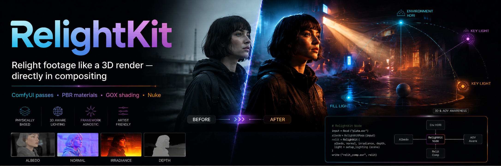
</div>

Physically based relighting for real footage in Nuke

Relight plates using Albedo, Normal, Irradiance, Depth passes generated from ordinary footage. RelightKit packs the passes into a clean Nuke workflow, derives material maps, and shades everything per-pixel on the GPU with a GGX BRDF.

---

## What it does

RelightKit takes a set of per-frame PBR passes (Albedo, Normal, Irradiance, Depth, Alpha) generated from ordinary footage — for example with the included ComfyUI workflow — packs them into a single multi-layer stream inside Nuke, derives Roughness / Metallic / Specular maps from those AOVs, and lets you place fully interactive 2.5D lights on top of your plate. All shading is computed per-pixel on the GPU with a physically based GGX BRDF (GGX distribution, Smith geometry, Schlick Fresnel).

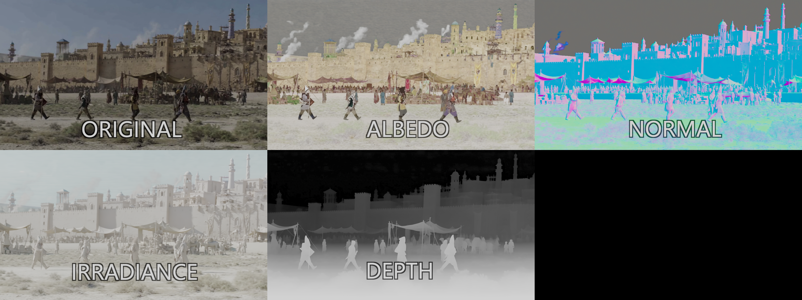
<br><sub>The AOVs RelightKit works with — albedo, normal, irradiance, depth and the derived material maps</sub>

## Examples

<table>
<tr>
<td align="center">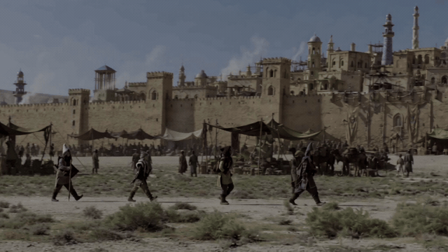<br><sub><b>Original footage</b></sub></td>
<td align="center">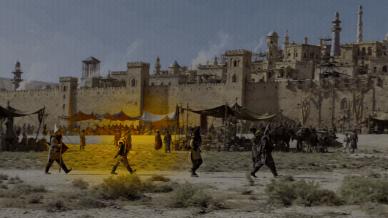<br><sub><b> Point Light</b></sub></td>
<td align="center">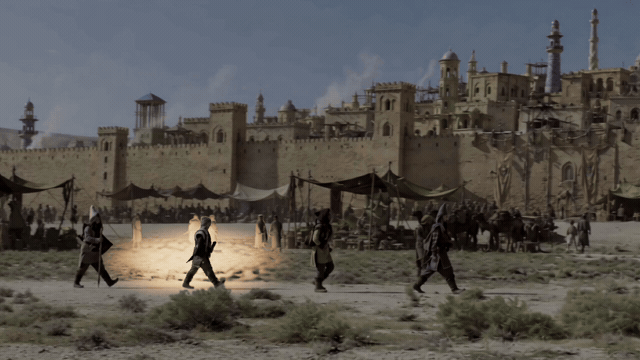<br><sub><b> Point Light (Depth)</b></sub></td>
</tr>
<tr>
<td align="center">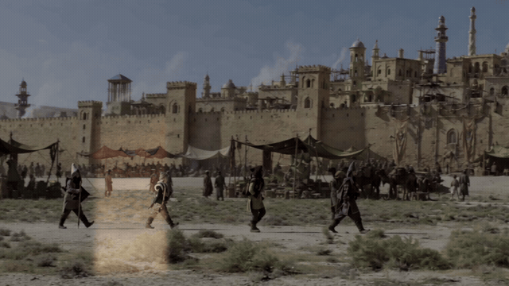<br><sub><b>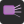 Area Light</b></sub></td>
<td align="center">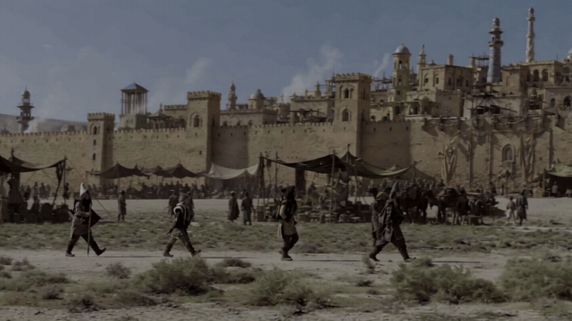<br><sub><b> Directional Light</b></sub></td>
<td align="center">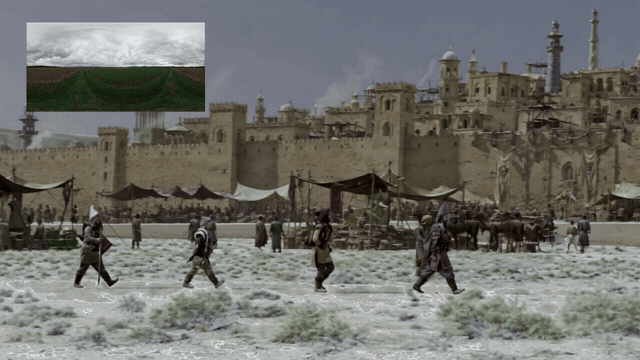<br><sub><b> Environment Light</b></sub></td>
</tr>
</table>

## Generating the PBR passes (ComfyUI)

A ready-to-use ComfyUI pipeline is included in [`workflow/RelightKit_FullPipeline.json`](workflow/RelightKit_FullPipeline.json). It produces the per-frame pass sequences (albedo, normal, irradiance, depth, alpha, source) that RelightKit consumes.

The pipeline is built on two excellent research projects:

- **[UniVidX](https://github.com/houyuanchen111/UniVidX)** — a unified multimodal video diffusion framework that extracts the intrinsic passes (Albedo, Irradiance, Normal) and alpha from real footage
- **[DVD](https://github.com/EnVision-Research/DVD)** — deterministic video depth estimation with generative priors, used for the temporally stable Depth pass

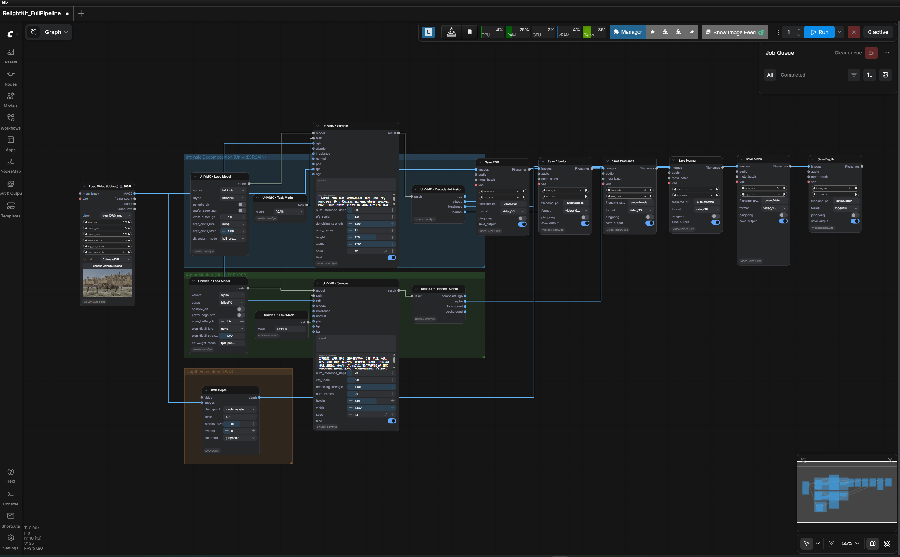
<br><sub>The full ComfyUI pipeline</sub>

## Loading passes in Nuke

Use  **RelightKit → Load PBR Passes** from the toolbar. Pick the folder with your rendered pass sequences and the loader builds everything for you: Read nodes with OCIO-aware colorspaces (linear for albedo/irradiance, raw for normal/depth/alpha, texture space for the source plate), wired into `RK_PBRPacker` → `RK_PBRController`.

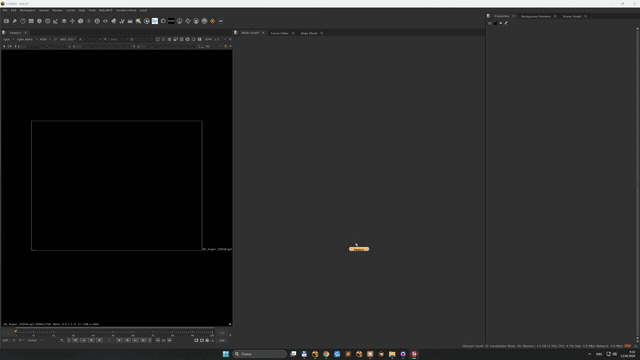

The loader looks for sequences named like `albedo_####.png`, `normal_####.exr`, etc. (or matching subfolders `albedo/`, `normal/`, ...). Albedo and Normal are required; Irradiance, Depth, Alpha and Source are optional but strongly recommended.

## The gizmos

### Helpers

| | Gizmo | Description |
|:-:|---|---|
|  | **RK_PBRPacker** | Packs the individual pass inputs (Albedo, Normal, Irradiance, Alpha, Depth, Source) into named layers (`Basecolor`, `Normal`, `Irradiance`, `Alpha`, `Depth`) on a single stream. |
|  | **RK_PBRController** | Adjusts the packed passes before lighting (normal intensity / flip Y, albedo gain & saturation, irradiance gain, alpha erode/blur) and **derives Roughness, Metallic and Specular maps from the AOVs** via a GPU kernel — specular from an irradiance high-pass, roughness from normal detail and inverse specular, metallic from the albedo/irradiance ratio. A single *Material Gain* slider drives all three. |

### Lights

All lights read the packed six-layer stream, shade with the full GGX BRDF, and share *Wrap*, *Original Light* mix and a *Light only (no albedo)* output mode.

| | Gizmo | Description |
|:-:|---|---|
|  | **RK_PointLight** | Screen-space point light with per-pixel distance attenuation and an Unreal-style smooth distance cutoff. |
|  | **RK_PointLightDepth** | 2.5D point light anchored with an on-screen handle; light depth is sampled from the Depth pass under the handle (with a *Freeze Depth* button), with ellipsoidal H/V/depth radii, edge softness and depth-edge anti-aliasing (soften / supersample). |
|  | **RK_DirectionalLight** | Infinite light set by Horizontal / Vertical angles — sun-style key light. |
|  | **RK_AreaLight** | Screen-anchored rectangular light with soft depth falloff, adjustable width/height, light height and softness. |
|  | **RK_EnvironmentLight** | Image-based lighting from an equirectangular HDRI: diffuse from a blurred HDRI lookup along N, specular along the reflection vector with roughness-aware sharp/blur blending and Fresnel, plus optional *Localize by Depth*. |
|  | **RK_LightMerge** | Combines up to five relit outputs (default `plus` for physically correct additive light) with a master intensity. |

## Installation

1. Copy (or clone) the `RelightKit` folder somewhere on disk.
2. Add it to your Nuke plugin path — e.g. in your `~/.nuke/init.py`:

   ```python
   nuke.pluginAddPath("/path/to/RelightKit")
   ```

   or add the folder to your `NUKE_PATH` environment variable.
3. Restart Nuke. A **RelightKit** menu appears in the Nodes toolbar with the loader, helpers, lights and Light Merge.

The bundled `init.py` registers the `gizmos/` and `icons/` folders automatically; `menu.py` builds the toolbar menu.

## Typical node graph

```
Read (albedo)  Read (normal)  Read (irradiance)  Read (depth)  Read (source)
      \             |               |                 |             /
       \            |               |                 |            /
        ────────────────  RK_PBRPacker  ──────────────────────────
                                │
                        RK_PBRController        (derive materials, tweak passes)
                          │           │
                 RK_PointLightDepth  RK_EnvironmentLight ── HDRI
                          │           │
                        RK_LightMerge (plus)
                                │
                             output
```

## Channel layout

The packed stream carries these layers:

`Basecolor` · `Normal` · `Irradiance` · `Alpha` · `Depth` — plus the derived `Roughness` · `Metallic` · `Specular` written by RK_PBRController.

## Requirements

- Nuke (a GPU is strongly recommended — all shading kernels run per-pixel).
- PBR pass sequences (e.g. from the included ComfyUI workflow).

## Acknowledgements

RelightKit would not exist without the research that makes the passes possible. Huge thanks to:

- The authors of **[UniVidX: A Unified Multimodal Framework for Versatile Video Generation via Diffusion Priors](https://github.com/houyuanchen111/UniVidX)** for the intrinsic decomposition (Albedo / Irradiance / Normal) and alpha models
- The authors of **[DVD: Deterministic Video Depth Estimation with Generative Priors](https://github.com/EnVision-Research/DVD)** for the depth estimation model

Please check out and cite their work if you use the generated passes in your own research or projects.

---

<div align="center">

<br>
<b>Aleš Ushakou</b> · <a href="https://www.linkedin.com/in/ales-ushakou/">linkedin.com/in/ales-ushakou</a>
</div>
